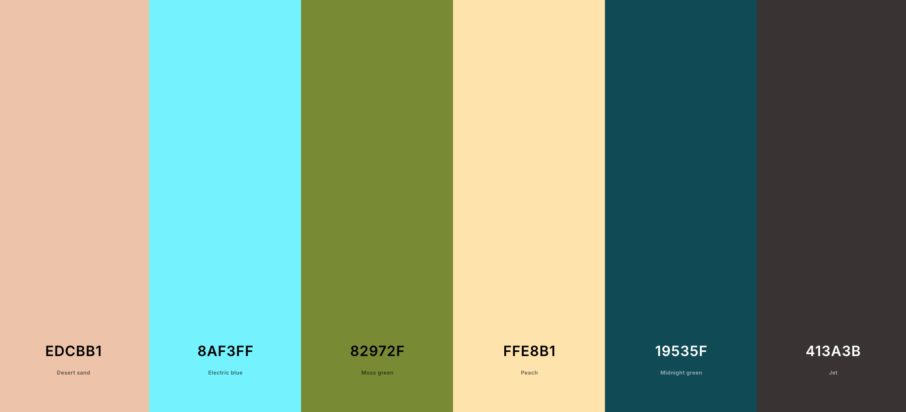

# PORTFOLIO WEBSITE
#### Link to portfolio website: https://www.tebasmartinez.com/
#### Video Demo:  https://youtu.be/_yQmDcpcc80?si=sWQOpIOo4lN7I0zB

## Description:
As a final project for CS50x, I've created my own portfolio website, which I plan to keep using after the course as I progress with learning Data Analytics and add more projects.

### HTML
The portfolio website contains 6 HTML files and allows easy navigation between pages using a [bootstrap navigation bar](https://getbootstrap.com/docs/5.3/components/navbar/). The files have been organised in directories for a cleaner URL structure.

- **Shared elements** \
All files include the header, footer, and same background colour, providing a consistent site experience.

- **/index.html** \
Contains the portfolio homepage. A clean page showing portfolio of projects displayed with [bootstrap cards](https://getbootstrap.com/docs/5.3/components/card/).
- **/about/index.html** \
Contains professional information: intro, skills, education, and experience. Uses:
  - [Bootstrap navigation card](https://getbootstrap.com/docs/5.3/components/card/#navigation) with [navigational tabs](https://getbootstrap.com/docs/5.3/components/navs-tabs/#javascript-behavior) with tabbable panes of local content, 
  - [bootstrap Flush lists](https://getbootstrap.com/docs/5.3/components/list-group/#flush) to separate elements in the education tab and the professional experience,
  - [shields.io badges](https://shields.io/badges) to visually display skills, and
  - [bootstrap badges](https://getbootstrap.com/docs/5.3/components/badge/#pill-badges) to style work experience locations.
- **/contact/index.html** \
Contains a contact form. Uses [bootstrap form layout](https://getbootstrap.com/docs/5.3/forms/layout/#forms), and [formsubmit.io](https://formsubmit.co/) to forward user messages.
- **/thankyou/index.html** \
Contains text thanking the user after submitting a message, enhanced with JavaScript.
- **/impressum/index.html** & **/datenschutzerklaerung/index.html** \
Contain legal texts.

### CSS
- **Used Bootstrap CSS framework.**
- **Created styles.css file:**
  - Comment-divided sections for readability.
  - :root pseudo-class to include colour palette.
  - Added styles to header, body, and footer tags.
  - Edited styles to some bootstrap classes.
  - Added styles to self-defined classes.
  - Used @media for different styles on desktop and mobile on some elements.
- **Added self-hosted fonts.**
  - Used ChatGPT to efficiently generate and edit the CSS for all fonts.
- **Colour palette:**
  - Used coolors.co to define my site's palette: https://coolors.co/edcbb1-8af3ff-82972f-ffe8b1-19535f-413a3b
  - Defined the colours under :root in styles.css

### JavaScript
- **Used Bootstrap's tab JavaScript plugin.**
  - Added [navigational tabs](https://getbootstrap.com/docs/5.3/components/navs-tabs/#javascript-behavior) with tabbable panes of local content inside one of the cards for skills, education, and online courses sections in about.html
- **Created JavaScript file for thankyou page personalization.**
  - After the contact form is used, JavaScripts edits the text in the thank you page to add the user's name. Safety measures have been taken to avoid JS injection: encoding input before adding it to URL, and then sanitizing the value taken, only including it in the page with .textContent

### Favicon
- Created the image with Canva and adapted it into the different sizes of a favicon package with [favicon.io](https://favicon.io/favicon-converter/)

### Hosting & Domain
- Page hosted on GitHub Pages at https://tebasmartinez.github.io/portfolio_website/ and linked to a custom domain https://www.tebasmartinez.com/

### Compliance
- To comply with local legal requirements, the website includes an Impressum, a Datenschutzerklärung, and a cookies disclaimer under the contact form.
