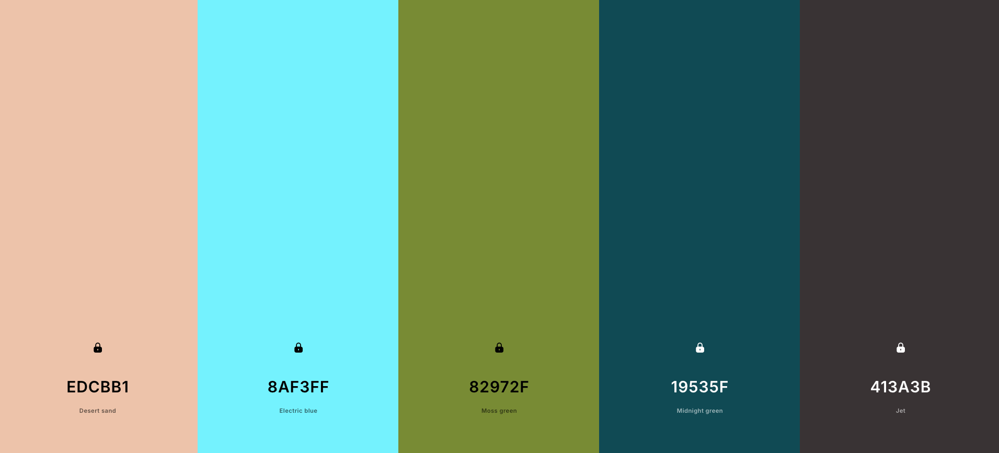

# PORTFOLIO WEBSITE
#### Video Demo:  <URL HERE>
## Description:
\[ WORK IN PROGRESS \] \
As a final project for CS50x, I've decided to create my own portfolio website, which I plan to keep using after the course as I progress with learning Data Analytics and add more projects.

## HTML:

## CSS:
- Using Bootstrap CSS framework.
- Using CSS Flexbox layout.
- Created styles.css file:
  - Comment-divided sections for readability.
  - :root pseudo-class to include colour palette.
  - Added styles to header, body, and footer tags.
  - Edited styles to some bootstrap classes: border-success, nav-link (+ nav-link:hover, nav-link.active), card, card-img-top, card-body, btn, contactform.
  - Added styles to self-defined classes: project-container, project-card-row, intro-card,.
  - Used @media for different behaviour on desktop.
  

### Colour palette:
 

[Link to palette online.](https://coolors.co/edcbb1-8af3ff-82972f-19535f-413a3b)

